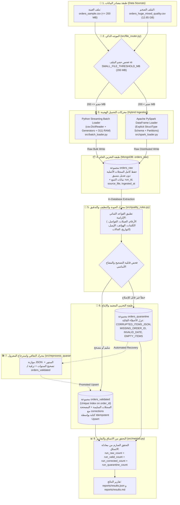

# وثيقة المعمارية الهندسية الشاملة لخط البيانات الهجين (ELT)
# Hybrid Data Pipeline Architectural Design Document (ADD)

---

## 📑 بطاقة المشروع (Project Metadata)

| البند | البيان التفصيلي |
| :--- | :--- |
| **المؤسسة الأكاديمية:** | جامعة الرازي - كلية الحاسوب وتكنولوجيا المعلومات |
| **المقرر الدراسي:** | البيانات الضخمة (Big Data) - العملي |
| **المحاضر المشرف:** | م. عمر أبوسند |
| **المشروع:** | خط بيانات هجين لمعالجة وتدقيق بيانات الطلبات (Hybrid ELT Orders Data Pipeline) |
| **نمط المعمارية:** | ELT (Extract $\to$ Load Raw $\to$ In-Database Transform & Validate) |
| **محركات المعالجة:** | Python Streaming Batch ($O(1)$ Memory) + Apache PySpark (Distributed DataFrame API) |
| **قاعدة البيانات:** | MongoDB 8.x (WiredTiger Engine, PyMongo Client, Unique Indexing) |
| **المسار المنفذ:** | مسار الطالب الفردي الكامل (10 / 10) وفق البنود 6.1 إلى 6.12 |

---

## 1. الملخص التنفيذي وأهداف التصميم (Executive Summary)

تم تصميم هذا النظام لمعالجة مجموعات بيانات التجارة الإلكترونية الضخمة وغير النظيفة (**Dirty Massive Datasets**) بكفاءة وموثوقية عالية.

### 🎯 التحديات الهندسية والحلول المعمارية:
1. **حظر نفاد الذاكرة (Zero OOM - $O(1)$ Complexity):**
   * منع استخدام `pandas.read_csv()` أو تحميل القوائم بالكامل في الذاكرة.
   * الاعتماد الصارم على مولدات التدفق (`Generators`) ودفعات متناسقة مع بروتوكول MongoDB (5,000 سجل $\approx$ 2.1 MB).
2. **الالتزام الصارم بمعمارية الـ ELT:**
   * تحميل السجلات الأصلية كما هي دون أي حذف أو فلترة مسبقة في مجموعة `orders_raw` مع حقول التتبع (`run_id`, `source_file`, `ingested_at`).
   * تطبيق التحويل والتدقيق داخل خط البيانات وقاعدة البيانات.
3. **التوجيه التلقائي الذكي (Smart Workload Routing):**
   * فحص حجم الملف وتطبيق حد **200 MB**:
     * $\le 200 \text{ MB} \to \text{Python Batch}$ (سرعة وخفة دون استهلاك إقلاع الـ JVM).
     * $> 200 \text{ MB} \to \text{PySpark}$ (معالجة متوازية موزعة عبر الـ Partitions).
4. **الموثوقية والتكرارية الصفرية (Idempotent Upsert):**
   * إنشاء فهرس فريد (`Unique Index`) على `order_id` في `orders_validated`.
   * تنفيذ عمليات الكتابة بـ `UpdateOne(..., upsert=True)` لتحقيق الخاصية الرياضية: $f(f(x)) = f(x)$.
5. **سجل التدقيق الجنائي والعزل التلقائي (Audit Trail & Quarantine):**
   * توثيق كل تصحيح آلي داخل مصفوفة `corrections` مع الحقل والقيمة السابقة والقيمة الجديدة ورمز القاعدة.
   * عزل السجلات ذات الأخطاء القاتلة في `orders_quarantine` برموز أخطاء رسمية.

---

## 2. المخطط المعماري الشامل وتدفق البيانات (System Architecture Diagram)



---

## 3. تفصيل الملفات والمكونات البرمجية بالكامل (Component Details)

### 3.1 مجلد الإعدادات المركزية (`config/`):
* **`config/settings.py`:**
  * المرجع المركزي لجميع الثوابت والمتغيرات.
  * يحدد `SMALL_FILE_THRESHOLD_MB = 200.0`، `BATCH_SIZE = 5000`، `MONGO_URI`، `MONGO_DB_NAME`.
  * يحتوي على قواميس المعايرة: `VALID_STATUS_MAP` (حالات الطلب المعيارية) و `ARABIC_WORDS_NUMBER_MAP` (ترجمة الكلمات العربية للأسعار).

---

### 3.2 مجلد المحركات والشيفرات المصدرية (`src/`):

* **`src/schema.py`:**
  * يُعرّف المخطط الصارم `SPARK_RAW_SCHEMA` المكون من 17 عموداً كـ `StringType()`.
  * يمنع تماماً الـ `inferSchema` التلقائي لحماية الأرقام المشرقية والنصوص من التحول إلى `null`.

* **`src/file_router.py`:**
  * يفحص حجم الملف بالبايت والميجابايت ويطبق شرط الـ 200 MB.
  * يطبع التبرير الهندسي المعتمد لسبب اختيار المحرك.

* **`src/create_small_sample.py`:**
  * يستخرج عينات خفيفة وقابلة للضبط (مثلاً 50 ألف سجل) من الملف الضخم (12.65 GB) بذاكرة ثابتة $O(1)$ دون استخدام Pandas.

* **`src/batch_loader.py`:**
  * محرك قراءة متدفق عبر `csv.DictReader` مع دعم ترميز `utf-8-sig`.
  * تجميع السجلات في دفعات من 5,000 سجل وحقنها في `orders_raw` بـ `insert_many`.

* **`src/spark_loader.py`:**
  * محرك المعالجة الموزعة PySpark باستخدام **DataFrame API**.
  * قراءة متوازية وتوزيع الـ Partitions مع إدارة آمنة للموارد عبر `try ... finally: spark.stop()`.

* **`src/quality_rules.py`:**
  * محرك القواعد النقية (Pure Functions) لتنفيذ القواعد الثماني الإلزامية:
    1. الأرقام المشرقية (`٠-٩` و `٫` $\to$ ASCII Float).
    2. توحيد العملة (`YER`).
    3. إزالة فواصل الآلاف والمسافات.
    4. ترجمة الكلمات العربية للأسعار.
    5. توحيد أرقام الهواتف إلى 9 أرقام تبدأ بـ 7.
    6. إصلاح تكرار رموز البريد الإلكتروني (`@@`, `..`).
    7. توحيد التواريخ إلى معيار ISO-8601 الدولي.
    8. تنظيف المسافات وتوحيد حالات الطلب للقاموس المعياري.
    9. إعادة حساب `total_amount` من المنتجات والتوصيل عند التلف `???`.
  * بناء سجل التدقيق `corrections` وتصنيف السجلات المعطوبة للعزل.

* **`src/mongo_setup.py`:**
  * إدارة اتصال MongoDB وإنشاء المجموعات الثلاث (`orders_raw`, `orders_validated`, `orders_quarantine`).
  * بناء الفهرس الفريد `idx_unique_order_id` على `order_id` لضمان عدم التكرار.

* **`src/elt_pipeline.py`:**
  * المنسق الشامل للمراحل الأربع لمعمارية الـ ELT.
  * تنفيذ الـ **Idempotent Upsert** عبر `UpdateOne(..., upsert=True)`.

* **`src/reprocess_quarantine.py`:**
  * محرك التعافي من الأخطاء (Dead-Letter Queue Recovery).
  * موازنة نصوص الـ JSON المقطوعة `}]` وتصحيح السنوات وترقية 68% من السجلات المعزولة إلى `orders_validated`.

* **`src/show_duplicates_demo.py`:**
  * أداة استعراض ومقارنة التكرارات في `orders_raw` قبل الدمج وسجلها الموحد في `orders_validated`.

* **`src/metrics.py`:**
  * قياس السرعة (Throughput) والزمن والتحقق الصارم من معادلة الاتساق وتصدير `results.json`.

* **`src/main.py`:**
  * نقطة الدخول الرئيسية الموحدة عبر سطر الأوامر (CLI).

---

### 3.3 مجلد الاختبارات الآلية (`tests/`):
* **`tests/test_cleaning_rules.py`:** 8 اختبارات لوحدات التنظيف والتصحيح.
* **`tests/test_classification.py`:** 7 اختبارات للتصنيف والعزل ومعادلة الاتساق.

---

### 3.4 دفتر جوبيتر والتقارير (`midterm_pipeline.ipynb` و `reports/`):
* **`midterm_pipeline.ipynb`:** دفتر تفاعلي مرتب بالكامل وفق البنود الرسمية 6.1 إلى 6.12 مع رسائل توضيحية قبل كل خطوة ورسائل اكتمال بعدها.
* **`reports/results.json`:** التقرير الرقمي الموثق بالمقاييس.
* **`reports/results.md`:** التقرير التنفيذي المنسق بالجداول ومؤشرات الأداء.

---

## 4. مصفوفة قواعد التنظيف الآلي الثماني (Quality Rules Matrix)

| # | اسم القاعدة | كود القاعدة | مثال خام (Raw) | بعد المعالجة (Cleaned) | السلوك الهندسي |
| :---: | :--- | :--- | :--- | :--- | :--- |
| **1** | **الأرقام المشرقية** | `R1_ARABIC_NUMERALS` | `"٧٠٦٠٠٠٫٠"` | `706000.0` (Float) | تحويل `٠-٩` والفواصل `٫` إلى أرقام ASCII ثم تحويلها لنوع رقمي. |
| **2** | **توحيد العملات** | `R2_CURRENCY_NORMALIZATION` | `"769000 YER"` | `769000.0` و `YER` | استخلاص الأرقام وتجريد رموز ونصوص العملات وتوحيد الحقل إلى `YER`. |
| **3** | **فواصل الآلاف** | `R3_THOUSANDS_SEPARATOR` | `"1,250,000.50"` | `1250000.50` (Float) | حذف الفواصل والمسافات الفاصلة داخل الأرقام. |
| **4** | **الأسعار بالكلمات** | `R4_PRICE_WORDS_TRANSLATION` | `"ألفان"` | `2000.0` | ترجمة الكلمات العربية الثابتة عبر جدول المعايرة. |
| **5** | **أرقام الهواتف** | `R5_PHONE_STANDARDIZATION` | `"+967 77 123 4567"` | `"771234567"` | إزالة مفتاح الدولة والمسافات وتوحيد الرقم إلى 9 أرقام تبدأ بـ 7. |
| **6** | **البريد الإلكتروني** | `EMAIL_REPEATED_SYMBOLS` | `"user@@mail..com"` | `"user@mail.com"` | إصلاح التكرار الواضح لرموز `@` و `.` بشرط البنية الصالحة. |
| **7** | **صيغ التواريخ** | `R7_DATE_STANDARDIZATION` | `"31/01/2025"` | `"2025-01-31T00:00:00"` | توحيد مختلف الصيغ إلى معيار ISO الدولي مع فحص منطقية السنة. |
| **8** | **المسافات وحالات الطلب** | `R8_WHITESPACE_AND_SYNONYMS` | `"  مؤكد  "` | `"CONFIRMED"` | تنظيف المسافات الزائدة وتوحيد الحالات للقاموس المعياري. |
| **9** | **إعادة حساب الإجمالي** | `R9_TOTAL_AMOUNT_RECALCULATION` | `total_amount = "???"` | $\sum \text{items} + \text{deliv}$ | إعادة حساب الإجمالي من مجموع المنتجات وتكلفة التوصيل. |

---

## 5. مصفوفة أسباب العزل (Quarantine Error Codes)

| كود الخطأ (Error Code) | سبب العزل (Reason) | المعيار الهندسي لمنع التخمين |
| :--- | :--- | :--- |
| **`CORRUPTED_ITEMS_JSON`** | نص تفاصيل المنتجات تالف أو غير صالح كـ JSON. | لا يمكن معرفة المنتجات أو أسعارها؛ يُمنع اختراع منتجات وهمية. |
| **`MISSING_ORDER_ID`** | رقم الطلب فارغ أو `null` أو مسافات بيضاء فقط. | `order_id` هو مفتاح العمل الأساسي ولا يمكن حفظ طلب بدونه. |
| **`INVALID_IMPOSSIBLE_DATE`** | التاريخ يحتوي على سنة مستحيلة خارج نطاق (2000 - 2100). | التواريخ المستحيلة تفسد التحليلات الزمنية ويُمنع التخمين العشوائي. |
| **`EMPTY_ITEMS`** | قائمة عناصر الطلب فارغة تماماً `[]`. | لا يمكن قبول طلب بيع يحتوي على صفر منتجات. |
| **`AMBIGUOUS_NEGATIVE_VALUE`** | مبالغ مالية أو كميات سالبة غير مبررة. | خطأ محاسبي لا يجوز قبوله كإيراد سليم. |

---

## 6. إثبات الموثوقية وعدم التكرار رياضياً وهندسياً (Idempotency Proof)

### 📌 التعريف الرياضي:
$$f(f(x)) = f(x)$$
إعادة تشغيل خط البيانات على نفس المدخل $x$ مرات متعددة يؤدي إلى نفس الحالة النهائية دون أي زيادة في عدد السجلات.

### 🛡️ آليات التحقيق:
1. **الفهرس الفريد (Unique Index):**
   ```python
   db.orders_validated.create_index([("order_id", ASCENDING)], unique=True, name="idx_unique_order_id")
   ```
2. **الكتابة عبر الـ Upsert:**
   ```python
   UpdateOne({"order_id": rec["order_id"]}, {"$set": rec}, upsert=True)
   ```
3. **النتيجة الفعلية لإعادة التشغيل:**
   * **`Inserted (New) = 0`**
   * **`Updated (Existing) = 100%`**
   * **`Duplicates = 0`**

---

## 7. معادلة الاتساق الصارمة (Consistency Invariant)

$$\boxed{\text{run\_raw\_count} = \text{run\_valid\_count} + \text{run\_corrected\_count} + \text{run\_quarantine\_count}}$$

```text
               1,000,000  (إجمالي ما دخل إلى orders_raw)
                   │
       ┌───────────┴───────────┐
       ▼                       ▼
  958,022 (تأهل للتحقق)     41,978 (عُزل في orders_quarantine)
       │
  ┌────┴────┐
  ▼         ▼
7,154     950,868
(سليم)   (مصحح آلياً)
```

---

## 8. دليل التشغيل السريع (Operational Commands)

```bash
# 1. سحب عينة مخصصة (مثلاً 50 ألف سجل):
python src/create_small_sample.py 50000

# 2. تشغيل خط البيانات الشامل مع تصفير المجموعات:
python src/main.py -f data/orders_sample.csv --reset-db

# 3. إثبات الـ Idempotency بإعادة التشغيل (0 سجل جديد):
python src/main.py -f data/orders_sample.csv

# 4. تشغيل مستعرض التكرارات قبل وبعد الدمج:
python src/show_duplicates_demo.py

# 5. تشغيل محرك إصلاح واسترجاع السجلات المعزولة:
python src/reprocess_quarantine.py

# 6. تشغيل حزمة الاختبارات الآلية (15 Unit Tests):
python -m unittest discover tests
```
